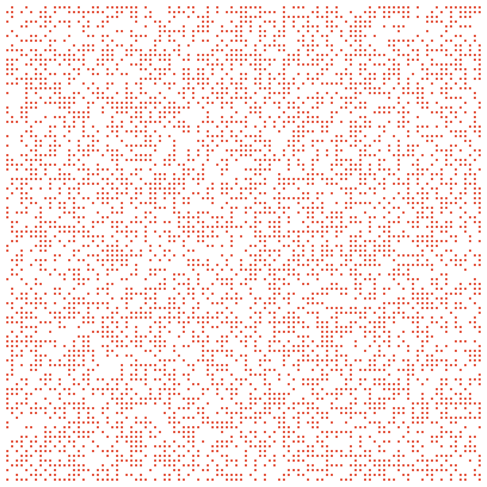
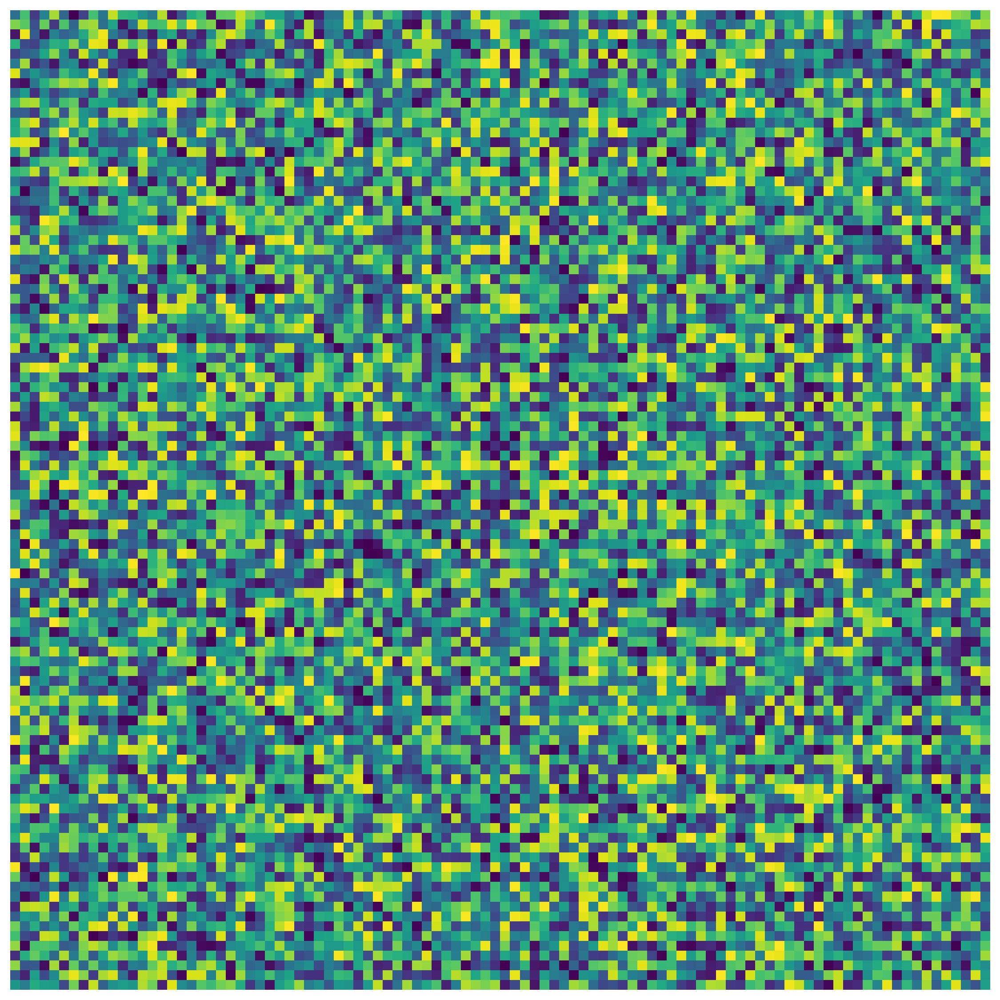
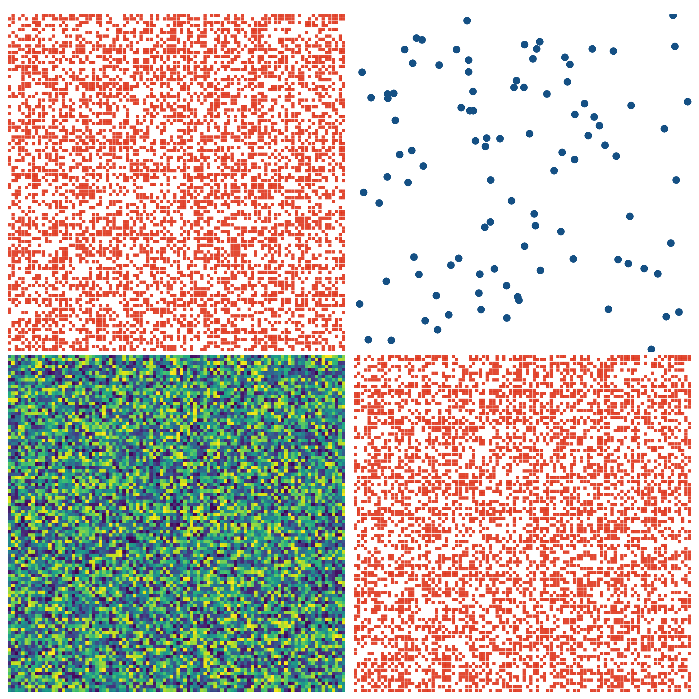

# wraplot

A simple pythonic matplotlib wrapper: plot, subplot and animate with ease.

## Installation

```bash
git clone git@github.com:LucaMoschella/wraplot.git
cd wraplot
poetry install 
```

## Sample usage

### Spy
```python
spyplot = Spy()
spyobj = Spy.Object(matrix=dense_matrix > 0.5,
                    axis_visibility='off',
                    markersize=4)
o = spyplot(spyobj)
```



### Imagesc
```python
spyplot = Spy()
spyobj = Spy.Object(matrix=dense_matrix > 0.5,
                    axis_visibility='off',
                    markersize=4)
o = spyplot(spyobj)
```


### PlotCloud
```python
cloudplot = PlotCloud2D()
cloudobj = PlotCloud2D.Object(points=points,
                              axis_visibility='off',
                              xlim=[0, 1],
                              ylim=[0, 1],
                              markersize=500)
o = cloudplot(cloudobj, outfile="sample/cloudplot.png")
```


### Subplotting
```python
subplotter = Subplotter()
o = subplotter(objs=[[spyobj, cloudobj],
                     [imagescobj, spyobj]],
               plot_functions=[[spyplot, cloudplot],
                               [imagescplot, spyplot]],
               outfile="sample/subplot.png")
```

 
### Animation
```python
animator = Animator()
for i in range(50):
    dense_matrix = dense_matrix @ dense_matrix
    o = imagescplot(Imagesc.Object(matrix=np.random.rand(100, 100).astype(np.float)))
    animator.add_figure(o)
animator.save("sample/video.mp4", fps=15)
```


# Live sample

```bash
streamlit run sample/demo
```

